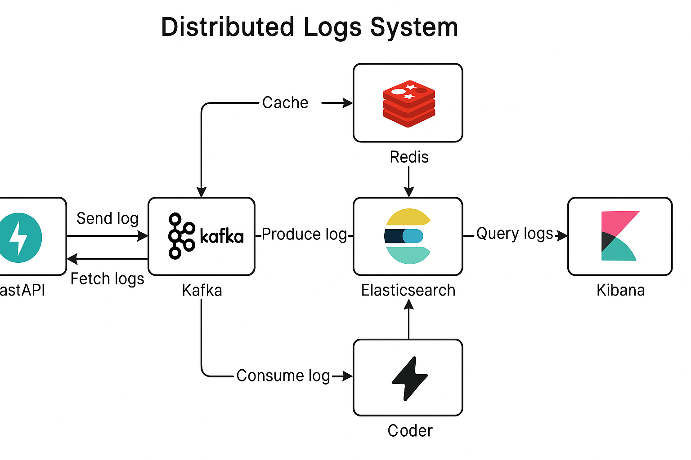

# 🧠 Distributed Logs System with FastAPI + Kafka + Elasticsearch + Kibana + Redis

A robust, scalable, and efficient logging system using **FastAPI**, **Kafka**, **Elasticsearch**, **Kibana**, and **Redis**. It enables:

- Ingesting logs via an API
- Asynchronous dispatch to Kafka
- Persistence to Elasticsearch
- Visualization with Kibana
- High-performance querying via Redis caching and multithreading
- Fault-tolerant and decoupled log handling

---

## 🎞️ Architecture Overview



---

## 📅 Tech Stack

- **FastAPI**: REST API
- **Kafka**: Queue for log delivery
- **Elasticsearch**: Scalable search engine
- **Kibana**: Visualization tool
- **Redis**: In-memory cache
- **ThreadPoolExecutor**: For multithreaded GET request handling

---

## 🪀 Why This Stack?

### ✅ Scalable
- Kafka handles massive ingestion without overloading Elasticsearch.
- Redis minimizes load on Elasticsearch by serving frequent queries.
- Threading optimizes API responsiveness under heavy concurrent reads.

### ⚡ Fast
- Redis gives sub-millisecond access to frequent results.
- Multithreading handles concurrent GET requests efficiently.

### 🛡️ Reliable
- Kafka decouples ingestion and storage: logs are never lost.
- Cleaner task maintains data integrity by removing old logs.

### 📊 Efficient
- Async log ingestion with Kafka
- Cached GET queries
- Non-blocking Elasticsearch access via threadpool

---

## 🚧 Redis Caching

- Every GET `/logs` request is cached using a hash key of the query params.
- If key is in Redis: return instantly
- If not: fetch from Elasticsearch, then store in Redis for 2 minutes

```python
# Redis GET flow
cache_key = hash(service + start + end)
if redis.exists(cache_key):
    return redis.get(cache_key)
else:
    logs = query_elasticsearch()
    redis.setex(cache_key, logs, ttl=120)
    return logs
```

---

## 🪜 Multithreading for Efficiency

GET requests use:
```python
await loop.run_in_executor(executor, function)
```
This offloads CPU-intensive Elasticsearch work to a threadpool, keeping the event loop free for other requests.

---

## 🚀 Getting Started

### 📁 Clone
```bash
git clone https://github.com/your-username/distributed-logs.git
cd distributed-logs
```

### 🚧 Docker Compose
```bash
docker-compose up -d
```

### 💡 Install Python Dependencies
```bash
python3 -m venv venv
source venv/bin/activate
pip install -r requirements.txt
```

### 🚀 Start FastAPI
```bash
uvicorn app.main:app --reload --port 8001
```

### 🚀 Start Kafka Consumer
```bash
python -m app.kafka_consumer
```

---

## 📊 Kibana Dashboard Setup

1. Go to: [http://localhost:5601](http://localhost:5601)
2. Discover tab → Create index pattern: `logs*`
3. Time filter: `timestamp`

---

## 📒 Project Structure
```
app/
🔽️ main.py            # FastAPI API with cache/threading
🔽️ models.py          # Pydantic model
🔽️ es_client.py       # Elasticsearch interface
🔽️ kafka_producer.py  # Kafka producer logic
🔽️ kafka_consumer.py  # Kafka consumer logic
🔽️ cleaner.py         # Periodic cleaner
log_generator.py       # Synthetic log poster
log_fetcher.py         # Random GET query tester
requirements.txt
docker-compose.yml
```

---

## 🪧 Requirements

```
fastapi==0.110.0
uvicorn[standard]==0.29.0
elasticsearch==8.12.1
python-multipart==0.0.9
requests==2.31.0
pydantic==1.10.13
httpx==0.27.0
kafka-python==2.0.2
urllib3==1.26.18
redis==5.0.1
```

---

## 📲 Synthetic Log Generator
```bash
python log_generator.py
```

## 🎯 Log Fetcher
```bash
python log_fetcher.py
```

---

## 📊 Sample API Endpoints

### ➕ POST `/logs`
```json
{
  "timestamp": "2025-03-28T10:00:00",
  "level": "ERROR",
  "message": "Something failed",
  "source": "auth-service"
}
```

### 🔍 GET `/logs`
```http
/logs?service=backend&start=2025-03-20T00:00:00&end=2025-03-28T00:00:00
```

---

## 📸 Screenshots


---

## 🚩 Summary

This project demonstrates a **production-grade** logging pipeline featuring:

- 🪜 **Multithreaded querying**
- 🪫 **Redis caching**
- ⚡ **Kafka-based ingestion**
- 📊 **Elastic-powered search**
- 🔍 **Kibana visual analysis**

Perfect for monitoring, debugging, and log analytics at scale.

---

Feel free to fork, extend, or scale it up further ✨

